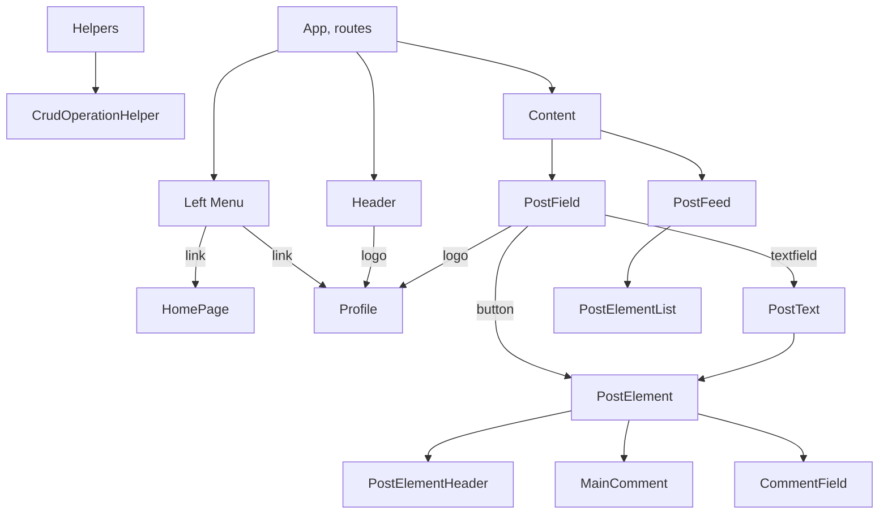

```mermaid
graph TD
    Helpers--> CrudOperationHelper

    A[App, routes] --> B[Header]
    A --> C[Left Menu]
    A --> Content

    %%leftMenu
    C -- link --> HomePage
    C -- link --> Profile

    %%header
    B -- logo --> Profile

    %%content
    Content --> PostField
    Content --> PostFeed

    %%post field
    PostField -- button --> PostElement
    PostField -- textfield --> PostText --> PostElement
    PostField -- logo -->Profile

    %%PostFeed
    PostFeed --> PostElementList
    PostElement --> PostElementHeader 
    PostElement --> MainComment 
    PostElement --> CommentField


```
